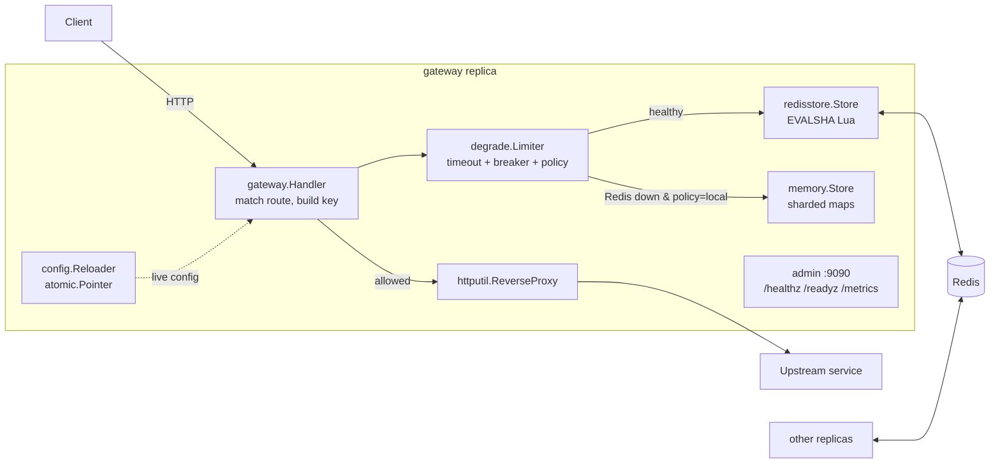

# floodgate

A Go reverse proxy that enforces shared per-client rate limits across replicas and keeps serving through Redis outages with explicit failure policies.

[](https://github.com/srujanmalakpata/floodgate/actions/workflows/ci.yml)
[](LICENSE)
[](go.mod)

## Highlights

- **One distributed budget:** atomic Redis Lua scripts share limits across replicas; the recorded Compose demo admitted **10 of 16 requests** across two gateways ([verification](VERIFICATION.md#summary), `TestTwoReplicasShareLimitsThroughRedis`).
- **Backend parity:** token buckets and exact sliding-window logs run the same `TestConformance` suite against memory, miniredis and real Redis ([verification](VERIFICATION.md#summary)).
- **Controlled outages:** timeout budgets, a circuit breaker and explicit open/closed/local policies are covered by `TestRedisOutageFailClosedAndOpen`, `TestRedisOutageFallsBackToLocalLimits` and `TestRedisCallHonoursContextDeadline` ([tests](internal/app/app_test.go)).
- **Bypass resistance:** canonical paths, trusted proxy hops and an IP backstop for rotating API keys; **10/10 deliberate mutations** were caught by targeted tests ([verification](VERIFICATION.md#mutation-checks)).
- **Operations without a shell:** distroless nonroot image, built-in HTTP probes, separate readiness/metrics endpoints and live config reload that preserves a valid configuration on error ([design](DESIGN.md#packaging-and-deployment), `TestReloader`).

**Tech stack:** Go 1.26.8+, Redis / Lua, Prometheus, Docker Compose, Kubernetes / Helm, Terraform (AWS ECS Fargate), GitHub Actions.

> Validation: earlier runs exercised the gateway, race tests, Docker image and Compose demo.
> Kubernetes, Helm and Terraform have been validated, never deployed to a cluster or AWS.
> The [2026-10-03 maintenance checks](VERIFICATION.md#maintenance-verification-2026-10-03) distinguish current passes from sandbox-blocked checks; historical measurements describe their original build.

Contents: [Quickstart](#quickstart) · [Architecture](#architecture) · [Features](#features) · [Local development](#local-development) · [Tests](#tests) · [Results](#results) · [Limitations](#limitations)

## Quickstart

Requires Git, Docker with BuildKit and Compose v2+, and Bash/curl. Docker builds the Go binaries;
no local Go installation is needed. Start Docker first and keep ports 8081/8082 and 9091/9092 free.

```bash
git clone https://github.com/srujanmalakpata/floodgate.git
cd floodgate
docker compose up --build --detach --wait --wait-timeout 180
./scripts/demo-shared-limits.sh 16
curl -fsS http://localhost:9091/metrics
docker compose down --volumes
```

The demo alternates requests between two gateways with one API key: on a fresh stack,
expect `allowed=10 limited=6`. Requests above the shared limit return `429` with `Retry-After`
and `RateLimit-*` headers. The last command removes the stack.

## Architecture

It sits in front of an HTTP service and
decides, per client and per route, whether each request may pass. Clients are identified
by an API-key header or by IP. Limits come from a YAML or JSON file that reloads without a
restart. Two backends hold the limiter state. The in-memory backend is a sharded map for a
single instance. The Redis backend runs atomic Lua scripts, so any number of gateway
replicas enforce one shared limit. If Redis goes down, a circuit breaker and an explicit
failure policy (fail-open, fail-closed, or per-replica local limits) decide what happens.
The repo includes a distroless Docker image, a two-replica docker-compose demo,
Kubernetes manifests and a Helm chart, Terraform for AWS ECS Fargate, and GitHub Actions CI.



```
internal/
  clock/        Clock interface + Fake clock for deterministic tests
  limiter/      Rule, Decision, Limiter interface; pure token-bucket and sliding-log math
    memory/     sharded in-memory backend (mutex per shard) + janitor
    redisstore/ Redis backend: token_bucket.lua, sliding_window.lua (go:embed)
    limitertest/ conformance suite every backend must pass
  breaker/      consecutive-failure circuit breaker
  degrade/      wraps the shared backend: timeout, breaker, fail-open/closed/local
  config/       YAML/JSON parsing, validation, route matching, hot-reloading Reloader
  gateway/      HTTP handler, headers, client keys, reverse proxy
  metrics/      Prometheus collectors on a private registry
  app/          wiring, admin endpoints, graceful shutdown (+ end-to-end tests)
cmd/gateway     the binary (signals: SIGHUP reload, SIGTERM drain)
cmd/upstream    tiny demo backend used by compose/Kubernetes
deploy/k8s      kustomize base + local overlay (with Redis and the demo upstream)
deploy/helm     Helm chart
deploy/terraform/aws  ECS Fargate + ALB + ElastiCache + CloudWatch (validated, never applied)
```

Design decisions and trade-offs: [DESIGN.md](DESIGN.md).

## Features

- **Two algorithms behind one interface** (`limiter.Limiter`):
  - *Token bucket*: allows bursts up to `limit` and refills `limit` tokens per `window`.
  - *Sliding-window log*: never more than `limit` requests in any trailing `window`, with no burst at fixed-window boundaries.
- **Two backends, one conformance suite**: the in-memory Go implementation and the Redis
  Lua scripts pass the same table-driven tests against miniredis and a real Redis 7.4.
- **Distributed limits**: every replica runs the same Lua script, and Redis executes it
  atomically, so there is no read-then-write race between replicas.
- **Degradation policy**: Redis calls have a timeout and sit behind a circuit breaker
  (closed, then open, then half-open). While Redis is down the policy is `open` (allow all), `closed`
  (reject with 503), or `local` (keep enforcing limits per replica in memory).
- **Standard responses**: `429` with `Retry-After`, plus `RateLimit-Limit`, `RateLimit-Remaining`, `RateLimit-Reset` and
  `RateLimit-Policy` headers. When two limits apply to a request (per key and per IP), the headers on an allowed
  response describe the tighter one, so `RateLimit-Remaining: 0` means the next request will be refused, and
  `RateLimit-Policy` lists both.
- **Client identity**: the client IP by default, with a `trusted_proxy_hops` setting so spoofed `X-Forwarded-For`
  entries are ignored. Routes can opt into `key_by: api_key` (SHA-256 of the key, so raw keys never reach Redis, logs or
  metrics). The gateway does not check that keys are real, so such routes take an `ip_limit` backstop that caps one IP
  across all the keys it invents.
- **Canonical paths and segment matching**: `//login`, `/./login` and `/x/..%2Flogin` are cleaned to `/login` before
  route matching, and the upstream receives the cleaned path, so duplicate slashes and dot segments cannot dodge a
  route's limit. Prefixes match whole path segments (`/login` covers `/login/x` but not `/login-help`; `/api/` also
  covers `/api`), and a route that lists `GET` also covers `HEAD`. Matching is case-sensitive (see Limitations).
- **Hot reload** of routes and limits on `SIGHUP` or a file change (polling also works with
  Kubernetes ConfigMap symlink swaps). An invalid file never replaces a working config.
- **Operations**: `/healthz`, `/readyz` and Prometheus `/metrics` on a separate admin port; JSON logs via `log/slog`
  (rejections are logged at Debug, so a flood of 429s does not flood the log);
  graceful shutdown (readiness fails, the gateway drains, then in-flight requests finish); `-check` validates a config,
  `-probe` runs a health check without curl, and `-version` prints the version stamped in at build time.
- **Packaging and IaC**: a multi-stage Dockerfile that produces a `distroless/static:nonroot` image (9.63 MB compressed in the recorded Linux build), docker-compose,
  kustomize manifests (Deployment, Service, ConfigMap, PDB, HPA), a Helm chart, Terraform for AWS
  (ECS Fargate, ALB, ElastiCache Redis with TLS and AUTH, CloudWatch Logs, autoscaling), and a GitHub Actions CI
  workflow. On a version tag, CI builds the image once,
  scans that image with Trivy and pushes the same image to GHCR.

## Local development

Requires Go 1.26.8+ and Bash/curl. Run these commands from the repository root in Bash.
Build first so signals reach the gateway process directly.

```bash
go build -o bin/ ./cmd/...
./bin/upstream &
UP=$!
until ./bin/gateway -probe http://localhost:9000/; do
  kill -0 "$UP" || exit 1
done
./bin/gateway -config examples/config.yaml &
GW=$!
trap 'kill "$GW" "$UP" 2>/dev/null; wait "$GW" "$UP" 2>/dev/null' EXIT
# Wait for observable readiness before sending requests.
until ./bin/gateway -probe http://localhost:9090/readyz; do
  kill -0 "$GW" || exit 1
done
for i in $(seq 7); do curl -s -o /dev/null -w '%{http_code} ' -X POST localhost:8080/login; done
# -> 200 200 200 200 200 429 429 (5 per minute per IP, sliding window)
curl -i -X POST localhost:8080/login
kill -HUP "$GW"                     # reload now; files are also polled every 5 s
kill "$GW" "$UP"
wait "$GW" "$UP"
trap - EXIT
```

Configuration reference: [examples/config.yaml](examples/config.yaml) (every field is commented).
Validate a file with `./bin/gateway -check -config FILE`.

With the Compose stack running, `docker compose stop redis` exercises per-replica local limits;
`docker compose kill -s HUP gateway-1` requests a reload. Cleanup: `docker compose down --volumes`.

## Tests

```bash
go test -race ./...                                    # unit, integration and end-to-end tests
RLGW_TEST_REDIS=localhost:6379 go test ./internal/limiter/redisstore/   # conformance suite on a real Redis
go test -run '^$' -bench . -benchmem ./...             # benchmarks
golangci-lint run ./...
make infra-check                                       # terraform validate, kubeconform, helm lint
```

- Table-driven unit tests drive the bucket math, config validation, route matching, path cleaning, IP/key extraction,
  rate-limit headers when two limits apply, breaker transitions (including stale outcomes) and failure policies with a
  **fake clock**, so algorithm and policy assertions do not depend on wall-clock timing.
  Listener and reload tests wait on observable state; shutdown waits for the upstream request and listener closure. A breaker stress test runs 8
  goroutines against one breaker under `-race` and checks that only one half-open probe is ever in flight.
- The **conformance suite** (`internal/limiter/limitertest`) runs the same scenarios against
  the memory store, Redis via miniredis, and (in CI or with `RLGW_TEST_REDIS`) a real Redis. It also checks that 320 concurrent
  calls admit exactly `limit` requests, and that both backends agree when the clock steps backwards.
- **End-to-end tests** (`internal/app`) start real listeners, an `httptest` upstream and a
  shared miniredis. They check that two replicas share limits; that a Redis outage is handled by each failure policy
  (`local` keeps limiting, `closed` answers 503 with `Retry-After` and a JSON body, `open` admits everything); that a hot
  reload that lowers a limit applies to clients that already have state; that a context deadline bounds a call to a
  Redis that never answers; and that graceful shutdown drains in-flight requests.
- **Mutation checks**: 10 deliberate bugs (Lua boundary, Retry-After rank, path cleaning, `ip_limit`, header choice,
  log ordering, breaker probe guard, go-redis context option, prefix matching, route-name validation) each made the
  targeted tests fail. See [VERIFICATION.md](VERIFICATION.md).

## Results

Measured on a shared 4-vCPU Linux container (Intel Xeon @ 2.80 GHz), 2026-10-03, Go 1.24.7 unless stated.
Other jobs were running on the host (load average 9–20), so treat absolute numbers as rough.
Benchmark figures are the median of 5 runs, with the range in brackets. Detailed results are in [VERIFICATION.md](VERIFICATION.md).

| What | Result |
|---|---|
| Tests (`go test -race ./...` with `RLGW_TEST_REDIS` set) | 48 test functions, 152 cases including subtests, all pass (default run without a real Redis: 138 pass, 1 skipped) |
| Statement coverage | 87.5–100 % per tested package; total including `cmd/` and untested helper packages 72.4 % |
| Mutation checks | 10 of 10 deliberate bugs caught by the tests |
| Token-bucket math (`Bucket.Take`) | 52 ns/op [47–59], 0 allocs |
| Sliding-log math (`Log.Take`, limit 100) | 124 ns/op [111–158], 0 allocs |
| In-memory store, 4 goroutines, random keys from 10k | 366 ns/op [309–379] with 64 shards; 462 ns/op [423–478] with 1 shard (see the note below) |
| Full handler, in-memory backend (no network) | 3.7 µs/op [3.0–4.7] |
| Redis backend, 4 goroutines, native `redis-server` 7.0.15 on localhost | 39 µs/op token bucket [38–54], 45 µs/op sliding window [43–65] |
| Same against `redis:7-alpine` 7.4.11 in Docker (port-forwarded) | 128 µs/op token bucket [98–140], 127 µs/op sliding window [90–154] |
| Load test (`hey -z 10s -c 32`, 5 interleaved repetitions, `log_level: info`, everything on localhost) | median req/s: upstream direct 17,393; plain proxy 3,936 [3,148–4,323]; gateway + memory 3,655 [3,404–4,149]; gateway + Redis 3,897 [3,510–4,209] |
| Docker image (`distroless/static:nonroot`, Go 1.26.8 build toolchain) | 9.63 MB compressed content size (9,627,409 bytes); 39.3 MB unpacked; Trivy: 0 HIGH/CRITICAL |
| Compose demo: 16 requests alternating between 2 replicas, limit 10 | allowed=10, limited=6 |

Main finding from the load test: on this shared host the three gateway configurations overlap, so the limiter's
overhead (memory or Redis) is smaller than the run-to-run noise and no percentage is claimed. The large drop from
"direct" to "plain proxy" is the extra proxy hop on a CPU-starved host. Redis-backend latency mostly measures the
network round trip: Redis itself reported 14–18 µs of server time per `EVALSHA` call (`INFO commandstats`), and the
Docker port-forward adds roughly 80–90 µs more than a native server.

Sharding measurements at 4 goroutines include non-overlapping ranges for 64 shards versus 1 shard, and another
sample on the same host with overlapping ranges (294 vs 357 ns/op). These results do not establish a speedup.
Across measurements on this host, `Log.Take` varies from 182 to 124 ns and the native-Redis token bucket from
102 to 39 µs (a 1.5–2.6x difference), showing how much host load affects these numbers.

## Limitations

- Infrastructure is **validated, not deployed**. `terraform validate`, kubeconform and `helm lint` pass,
  but nothing was applied to AWS or a real cluster. Local cluster creation with kind failed at `kubeadm init`.
- Redis timestamps come from each gateway replica's clock. The token-bucket script clamps time (a lagging replica
  never refills tokens or moves a key's time backwards). The sliding-window script does not: each replica prunes and
  scores entries with its own clock, so with skew `s` between replicas the window edge can move by up to `s` and a
  little more than `limit` requests can pass in a real-time window. Keep hosts NTP-synced. See [DESIGN.md](DESIGN.md).
- `key_by: api_key` trusts any key a client sends. Use it only behind something that authenticates keys, or set
  `ip_limit` on the route (all shipped configs do). The default is `key_by: ip`.
- The `ip_limit` check runs before the per-key check and counts attempts, so a request the per-key limit then refuses
  has still used one unit of the IP's budget. Clients behind one NAT share that budget, and one client hammering an
  exhausted key uses it up for the others. The order is deliberate (see [DESIGN.md](DESIGN.md)).
- Route matching is case-sensitive, like Go's `ServeMux`. In front of an upstream that treats `/LOGIN` as `/login`,
  a client could avoid a `/login` limit by changing case; such upstreams need a route per spelling or a default route.
- A client that disconnects while its Redis call is in flight does not cut the call short: go-redis v9 applies the
  context's *deadline* to socket I/O but not plain cancellation, so the call ends within `backend.redis.timeout` (50 ms by default).
- The sliding-window log stores one entry per admitted request, so memory is O(limit) per key; config validation
  rejects sliding-window limits above 10,000. Larger limits would call for a sliding-window *counter* approximation.
- The `local` failure policy enforces the limit per replica, so N replicas may admit up to N times the limit during an outage.
- A Redis Cluster deployment works key by key (each script touches one key), but it was only tested against single-node Redis.
- The minimum build toolchain and Docker image use Go 1.26.8; CI scans both that release and current stable Go.
  Older Go 1.24.7 builds had standard-library advisories. See the dated verification records for scan results
  and checks blocked in the current environment.

## License

MIT. See [LICENSE](LICENSE).
